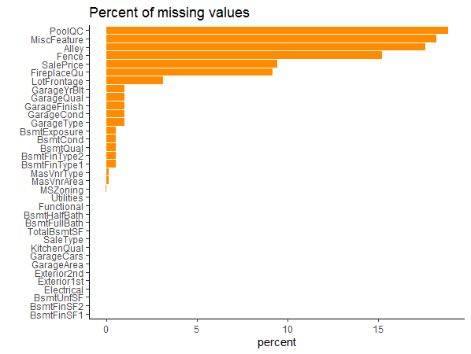
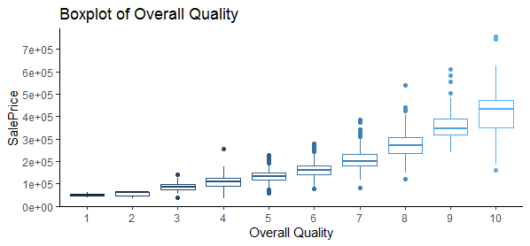
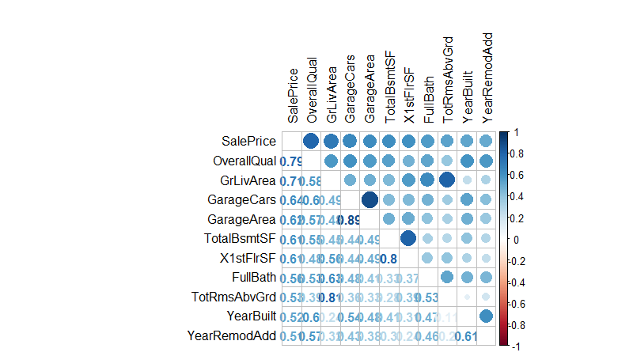
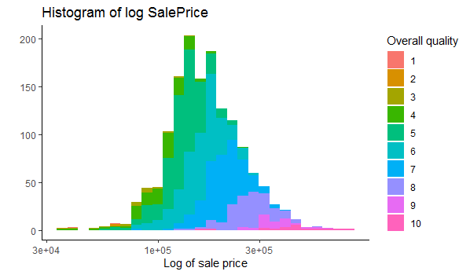
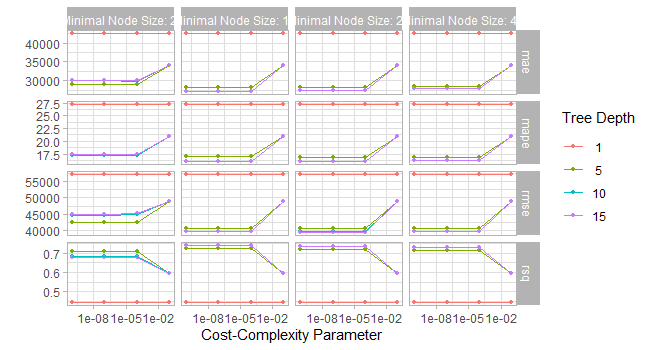
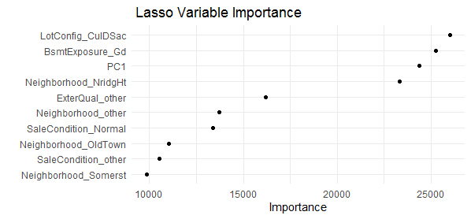

# Advanced-Linear-Regression-House-Price-Prediction
## Project Overview
Created a model that estimates the prices of houses based on 80 predictory house features.
Optimized Random Forest , Lasso Regression, XGBoost and tree decision models to reach the best model.

## Code and resources used
**R version:** Rmarkdown

**Packages:** Plyr,tidyverse,tidymodels,corrplot,vip

## Data cleaning

The data had multiple missing data so I had to clean it for model building.

Here is a graph of the percent of missing variables.

None of the percntage of missing values were more than 20% so we imputed all of them.

## EDA

Here are some highlights of the visualizations I did.

## Model building

I built four different models (lasso regression, random forest, xgboost and decision trees) and the best perfomance was achieved by lasso regression.

The lasso regression metrics were:

   * Mean Absolute Error(MAE) - 23704.

   * Root Mean Squared Error(RMSE) - 33874.

   *  R-squared - 0.804.

   * R-squared trad - 0.798.
   
   

    
